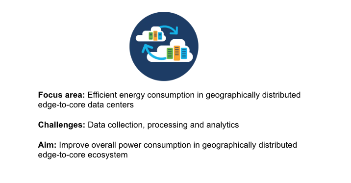
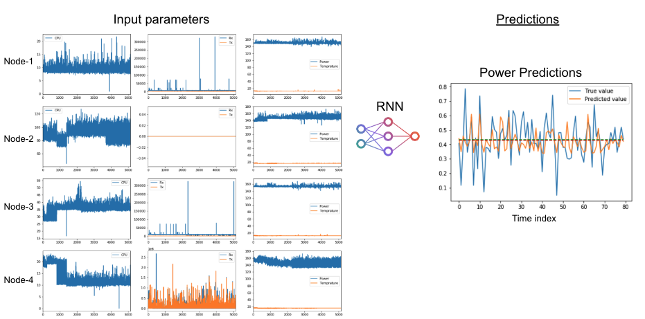

# Power consumption prediction for data centers (TensorFlow/Keras and PyTorch)



This is an example of a neural network regression model in a federated setting. Time series data from two data centers in Sweden and Finland are used to predict the relationship between CPU and Network usage and power consumption. The tutorial is based on the following article that has more background information on the use-case: 

- Towards Smart e-Infrastructures, A Community Driven Approach Based on Real Datasets
https://ieeexplore.ieee.org/document/9289758

The model in this example is a simplified version of the model used in the article, aimed at reducing the compute requirements on the client side. A typical laptop or workstation should be capable of handling multiple clients. A partition of the dataset needed for this example is publically accessible.

```sh
wget --no-check-certificate 'https://docs.google.com/uc?export=download&id=1r_dlOEZAnCLhRjY1qFwlRAkeB4PvhgAU' -O power.npz
```

To access the complete dataset, please get in touch with Scaleout staff. The following figure illustrates the overall concept of the example.




In case you have any questions, feel free to contact us. 


## Prerequisites, when running clients in Docker containers

- [Python 3.8, 3.9, 3.10 or 3.11](https://www.python.org/downloads)


Creating the compute package and seed model
-------------------------------------------

Install fedn:

```sh
   pip install fedn
```sh

Clone this repository, then locate into this directory:

```sh
   https://github.com/scaleoutsystems/power-consumption-tutorial.git
   cd power-consumption-tutorial/Power-consumption-pytorch
```sh

Create the compute package:

```sh
   fedn package create --path client
```sh

This should create a file 'package.tgz' in the project folder.

Next, generate a seed model (the first model in a global model trail):

```sh
   fedn run build --path client
```sh

This will create a seed model called 'seed.npz' in the root of the project. This step will take a few minutes, depending on hardware and internet connection (builds a virtualenv).

Download the dataset:

For Linux and MacOS

```sh
   mkdir power-consumption-tutorial/Power-consumption-pytorch/data
   wget --no-check-certificate 'https://docs.google.com/uc?export=download&id=1r_dlOEZAnCLhRjY1qFwlRAkeB4PvhgAU' -O power.npz
```

For Windows users, download the dataset using your preferred browser or tool by following the link below.

`https://docs.google.com/uc?export=download&id=1r_dlOEZAnCLhRjY1qFwlRAkeB4PvhgAU`

Using FEDn Studio
-----------------

Follow the guide here to set up your FEDn Studio project and learn how to connect clients (using token authentication): [Studio guide](https://fedn.readthedocs.io/en/stable/studio.html). On the step "Upload Files", upload 'package.tgz' and 'seed.npz' created above.

Connecting clients:

```sh
export FEDN_PACKAGE_EXTRACT_DIR=package
export FEDN_DATA_PATH=<full_path_to_the_dir>/data/power.npz
```

```sh
fedn client start -in client.yaml --secure=True --force-ssl
```


Connecting clients using Docker:

For convenience, there is a Docker image hosted on ghrc.io with fedn preinstalled. To start a client using Docker:

```sh
docker run \
  -v $PWD/client.yaml:/app/client.yaml \
  -v $PWD/client_settings.yaml:/app/client_settings.yaml \
  -v $PWD/data:/app/data \
  -e FEDN_PACKAGE_EXTRACT_DIR=package \
  -e FEDN_DATA_PATH=/app/data/ \
  -e FEDN_CLIENT_SETTINGS_PATH=/app/client_settings.yaml \
  -e FEDN_DATA_SPLIT_INDEX=0 \
  ghcr.io/scaleoutsystems/fedn/fedn:0.9.0 run client -in client.yaml --force-ssl --secure=True
```


Now on the session tab in the Studio, click on the start session to initiate the training rounds. 

For more details about FEDn SDK or FEDn Studio, click on the following [link](https://fedn.readthedocs.io/en/stable/introduction.html) 

